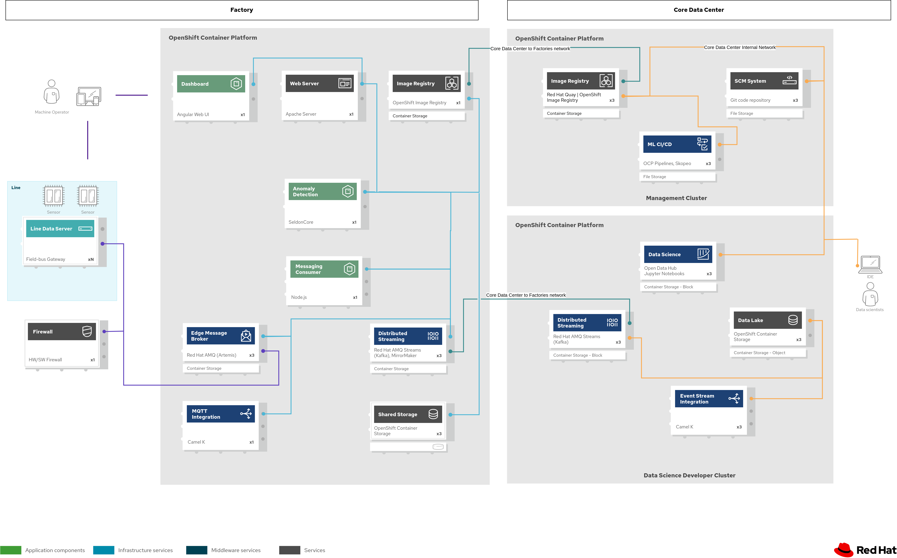

# Start Here

If you've followed a link to this repo, but are not really sure what it contains
or how to use it, head over to http://hybrid-cloud-patterns.io/industrial-edge/ 
for additional context before continuing. 

# Prerequisites

1. An OpenShift cluster ( Go to https://console.redhat.com/openshift/create )
1. (Optional) A second OpenShift cluster
1. A github account
1. A quay account
1. The helm binary, see https://helm.sh/docs/intro/install/ 

The use of this blueprint depends on having at least one running Red Hat
OpenShift cluster. It is desirable to have a cluster for deploying the data
center assets and a seperate cluster(s) for the factory assets.

If you do not have a running Red Hat OpenShift cluster you can start one on a
public or private cloud by using [Red Hat's cloud
service](https://console.redhat.com/openshift/create).

# How to deploy

1. Fork this repo on GitHub. It is necessary to fork because your fork will be updated as part of the GitOps and DevOps processes.

1. Clone the forked copy

   ```
   git clone --recurse-submodules git@github.com:your-username/industrial-edge.git
   ```

1. Create a local copy of the Helm values file that can safely include credentials

  DO NOT COMMIT THIS FILE
  
  You do not want to push personal credentials to GitHub.
   ```
   cp values-secret.yaml.template ~/values-secret.yaml
   vi ~/values-secret.yaml
   ```

1. Customize the deployment for your cluster

   ```
   vi values-global.yaml
   git commit values-global.yaml
   git push
   ```

1. Preview the changes
   ```
   make show
   ```

1. Login to your cluster using oc login or exporting the KUBECONFIG

   ```
   oc login
   ```

   or 
   
   ```
   export KUBECONFIG=~/my-ocp-env/datacenter
   ```

1. Apply the changes to your cluster

   ```
   make install
   ```
   
1. Check the operators have been installed 

   ```
   UI -> Installed Operators
   ```

1. Obtain the ArgoCD urls and passwords

   The URLs and login credentials for ArgoCD change depending on the pattern
   name and the site names they control.  Follow the instructions below to find
   them, however you choose to deploy the pattern.

   Display the fully qualified domain names, and matching login credentials, for
   all ArgoCD instances:

   ```
   ARGO_CMD=`oc get secrets -A -o jsonpath='{range .items[*]}{"oc get -n "}{.metadata.namespace}{" routes; oc -n "}{.metadata.namespace}{" extract secrets/"}{.metadata.name}{" --to=-\n"}{end}' | grep gitops-cluster`
   eval $ARGO_CMD
   ```

   The result should look something like:

   ```
   NAME                       HOST/PORT                                                                                         PATH      SERVICES                   PORT    TERMINATION            WILDCARD
   datacenter-gitops-server   datacenter-gitops-server-industrial-edge-datacenter.apps.mycluster.mydomain.com          datacenter-gitops-server   https   passthrough/Redirect   None
   # admin.password
   2F6kgITU3DsparWyC

   NAME                    HOST/PORT                                                                                   PATH   SERVICES                PORT    TERMINATION            WILDCARD
   factory-gitops-server   factory-gitops-server-industrial-edge-factory.apps.mycluster.mydomain.com          factory-gitops-server   https   passthrough/Redirect   None
   # admin.password
   K4ctDIm3fH7ldhs8p

   NAME                      HOST/PORT                                                                              PATH   SERVICES                  PORT    TERMINATION            WILDCARD
   cluster                   cluster-openshift-gitops.apps.mycluster.mydomain.com                          cluster                   8080    reencrypt/Allow        None
   kam                       kam-openshift-gitops.apps.mycluster.mydomain.com                              kam                       8443    passthrough/None       None
   openshift-gitops-server   openshift-gitops-server-openshift-gitops.apps.mycluster.mydomain.com          openshift-gitops-server   https   passthrough/Redirect   None
   # admin.password
   WNklRCD8EFg2zK034
   ```


1. Check all applications are synchronised

# Pattern Layout and Structure

https://slides.com/beekhof/hybrid-cloud-patterns

# Uninstalling

**Probably wont work**

1. Turn off auto-sync

   `helm upgrade manuela . --values ~/values-secret.yaml --set global.options.syncPolicy=Manual`

1. Remove the ArgoCD applications (except for manuela-datacenter)

   a. Browse to ArgoCD
   a. Go to Applications
   a. Click delete
   a. Type the application name to confirm
   a. Chose "Foreground" as the propagation policy
   a. Repeat

1. Wait until the deletions succeed

   `manuela-datacenter` should be the only remaining application

1. Complete the uninstall

   `helm delete manuela`

1. Check all namespaces and operators have been removed

# Diagrams

The following diagrams show the different components deployed on the datacenter and the factory.

## Logical


## Schematic with Networks



## Schematic with Dataflows


## Editing the diagrams.

To edit the diagrams in Draw.io you can load them [here](https://redhatdemocentral.gitlab.io/portfolio-architecture-tooling/index.html?#/portfolio-architecture-examples/projects/Mfg-AI-ML-0928.drawio) and save a local copy
